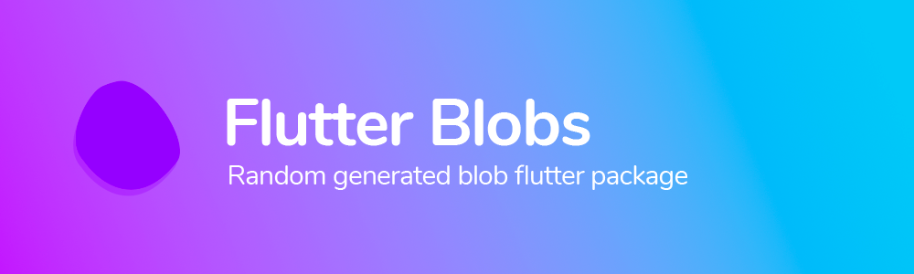
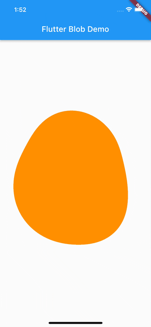

<p>

</p>

# Blob Flutter package
Add fancy blobs to your flutter apps. <br>
You can now imagine many usage of blobs into your app (button, loader, background...).



## Features
- blob layout
- blob button
- customize your blob as you want

## Roadmap 
- improve documentation
- migrate shader to umbra 
- shader: wait for flutter glsl int / array support
- shader: wait for flutter glsl output support 
- shader: create a gradient version
- button: add push effects
- button: provide custom method to let user create it's own on push effects

## Getting started
install the `flutter_blob` package.

## Usage
### Layout

```dart
BlobLayout.from(
    blobs: myBlobsList,
    blobsColor: Colors.blue,
)
```

or using the builder function (recommended)
```dart
BlobLayout.builder(
    builder: (Size areaSize) => [
        RotatingParticle.random(area),
        RotatingParticle.random(area),
        RotatingParticle.random(area),
        RotatingParticle.random(area),
        RotatingParticle.random(area),
        RotatingParticle.random(area),
        RotatingParticle.random(area),
        RotatingParticle.random(area),
    ],
    blobsColor: Colors.blue,
)
```
> You must provide exactly 8 blob
> This is due to a current limitation of the flutter shader support

An example is available in the example folder of this repository.

### Button
For now buttons only support icon. 

```dart
BlobButton.bouncing(
    onTap: () => print("do w/e you want"),
    backgroundColor: Colors.amber[900],
    icon: Icon(
        Icons.add,
        color: Colors.white,
        size: 32,
    ),
)
```

> You must provide exactly 8 blob
> This is due to a current limitation of the flutter shader support

An example is available in the example folder of this repository.

## Customize
The blob is generated using multiple particles that attracts each others. <br>
A shader calculate the energy between those particles for each pixel of a canvas. <br>
<br>
You can customize your blob effects combining 8 particles.
<br>
The is 3 types of particles available in this package (feel free to create yours or suggest some 👍)
- BasicParticle <br>
*(randomly goes on one way and when touch a border bounce to the other side)*
- EjectedParticle <br>
*(Generated on the center and randomly goes out. Once it touch a border, it's generated on the center again)*
- RotatingParticle <br>
*(randomly move in a circle around the center.)*

## How it works
// coming soon


## Additional information
- 👌 contributions or ideas accepted
- 🤝 I made this package learning how shaders works. <br> 
I'm always open to learn new things. <br>
Don't hesitate suggesting any improvement, I love it. 
## Social
You can reach me on:<br>
[@mcflyDev on twitter](https://twitter.com/mcflyDev)

